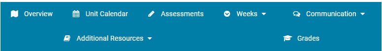
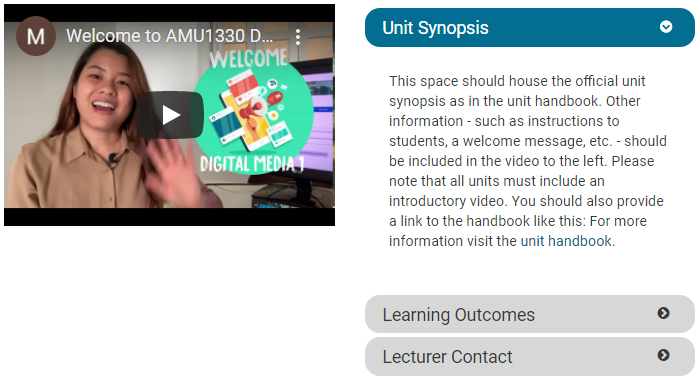

# Moodle Technical Documentation

## Introduction

This section provides an overview of the Moodle Technical Documentation at Monash University Malaysia.

## About

The document was created to give Moodle users a through understanding of how we built the overhauled Moodle Template in Moodle. This document is aimned at site maintainers for the Moodle Template and relevant departments involved in the Moodle Template overhaul. Some useful background information that will be beneficial to the reader includes but not limited to basic web development and problem solving.

## Table of Contents

1. [Moodle Template](#moodle-template)
    1. [Repository](#moodle-template-repo)
    2. [Requirements](#moodle-template-req)
    3. [Usage](#moodle-template-use)
    4. [Best Practices](#moodle-template-bp)
2. [Teaching & Learning Portal](#t&l)
3. [FAQ](#faq)

### Moodle Template <a name="moodle-template"></a>

#### Repository <a name="moodle-template-repo"></a>

The moodle-template repository is the main template used by the following schools:

- School of Business
- School of Science

The moodle template works by editing the HTML code manually inside the settings of the Moodle page. The repository for the codes used by the schools mentioned above are located [here](https://github.com/MUM-MIH/moodle-template).

#### Requirements <a name="moodle-template-req"></a>

```
Language: HTML, Javascript, CSS
Editor: Atto
```

#### Usage <a name="moodle-template-use"></a>

To edit the HTML code,

- Toggle the button _Turn Editing On_ located on the top right corner of the page.
- Hover the cursor the section you want to edit.
- Click on the *Edit* button dropdown menu.
- Click :gear: Edit Settings to begin editing.

A basic guide to matching filenames to the function of the Moodle Template:



> The **Menu Bar** is controlled by the _ _menubar.html_ file.



> The **Accordion** is controlled by the _ _accordion.html_ file.

With this information in hand, you can easily match the section of the Moodle page to the file located inside the repository.

#### Best Practices <a name="moodle-template-bp"></a>

##### Backup, backup, backup

Comes without saying, trying something new? Save the old file in a word editor. Fixing something broken because of an update? Save the old file in a word editor. Last thing you want is trying to Ctrl + Z to no avail.

##### Editor Preference

Please ensure that the editor preference in the Moodle settings is set to the Atto editor as stated in the requirements section. This is very important as other editors might cause conflicts.

##### Hidden Block

There is a _hidden block_ located in the right hand side of the Moodle page. This block controls all the Javascript functionality in the page. By editing this block, all Javascript functionality will stop working.

However, in an event there is a need to edit this block. The following steps need to be performed:

1. Turn Editing On.
2. Turn on *Developer Mode* in your browser. On Google Chrome it is set to F12 by default.
3. In the *Developer Mode* menu, select _Elements_ as you need to inspect the hidden block.
4. Hover to the hidden block and *Inspect* it by right clicking it and selecting it.
5. Look for the following line of code inside the Elements Inspect Tab:

    ```html
    <div class="card-body p-3" id="yui_3_17_2_1_1628758723274_4716">
        <div class="block-controls float-right header">

        </div>
    </div>
    ```

    > We are looking for the class="block-controls float-right header"

6. Select that class in the Elements tab, look for the *display* element, it will be *none*.
7. Change the field from *none* to *block*.
8. The hidden block can now be edited.

##### Naming Conventions

In MIH, we use [snake case](https://chaseadams.io/posts/most-common-programming-case-types/#snake_case) to name our files. This will give us a uniform file naming protocol to prevent confusion between developers.

A few examples:

- *BU_* stands for _backup_ that are used to keep important files in a safe, immutable place.
- *icon_* stands for _icons_ that are used to display custom icons in the Moodle page.

It is up to the developer to best decide how files are named to ensure uniformity.

---

### Teaching & Learning Portal <a name="t&l"></a>

TBA

### FAQ <a name="faq"></a>

During editing, the accordion object disappears even though I didn’t modify it. What should I do?

> Once you have completed your own edits, turn edit mode off and refresh the page OR click on the Overview tab again. The accordion should reappear. This is a known bug that is still currently under investigation.

During editing, the accordion object is not working (does not hide/collapse content).

> If you have not modified the accordion object, this is normal. Once you turn editing off, the element will function normally. This is a known visual bug and is also currently under investigation. If you have modified it, try turning editing off and refreshing the page. If the issue persists, duplicate a new accordion element from ‘Design Resources’ and try again.

Can I customise the grid thumbnails on the Overview page?
> *No*. The thumbnails were designed with the overall look and feel in mind. Please do not add your own icons to the grid as this may impede future efforts to troubleshoot errors or make updates.

Can I add new sections to my Moodle site?
> *No*. Please try to work with the sections that the template provides. For the most part, you should try to make sure all resources are located within the relevant weekly sections. Any additional resources that do not fit logically into a weekly page may be placed in the Study Resources section. If you feel that your unit requires an additional section, please contact us for further support.

How do I check if the editor is Atto?
> Profile > Preferences > Editor Preferences > Text Editor > Atto HTML Editor
